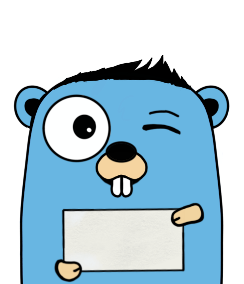

# Notify



Notify is a library to create notification systems.
Imagine that you want to send **server sent events** to the browser through HTTP or you've been asked to send user feedbacks after long running processes; this is the right place for you.

Notify works with a [pub-sub](https://en.wikipedia.org/wiki/Publish%E2%80%93subscribe_pattern) model at its core; it esposes a minimal API to Publish and Subscribe to a channel.

## API 

### Full example (Redis v8)

```go
import (
	"context"

	"github.com/go-redis/redis/v8"

	"github.com/toretto460/notify/channel"
	"github.com/toretto460/notify/driver"
)

redisCli := redis.NewClient(&redis.Options{
    Addr: "localhost:6379",
})

ctx := context.Background()
redisDriver := driver.NewRedis(redisCli)
chFactory := channel.NewFactory(&redisDriver)

ch, _ := chFactory.New()

go func(){
    messages, _ := ch.Receive(ctx)
    for msg := range messages {
        // do something, i.e. Send to the user
    }
}()

for {
    time.Sleep(time.Second)
    ch.Send(ctx, model.NewMessage([]byte("message content")))
}
```

### API explained

Here you can find a simple explaination of the package surface that you're going to use to work with notify.

#### Drivers

Notify is a driver based library; it has been build in this way to allow support for different types of backend.
The currently implemented drivers are:

- Redis (based on the github.com/go-redis/redis/v8 version)
- Standalone (an in memory deiver based on golang channels)

NOTE: Beware that the standalone driver is meant to be used only for development purpose, it's not production ready.

**Examples**
 
<details>
<summary>Redis</summary>
```go
redisCli := redis.NewClient(&redis.Options{
    Addr: "localhost:6379",
})
redisDriver := driver.NewRedis(redisCli)
```
</details>

<details>
<summary>Standalone (only for local testing)</summary>
```go
ctx := context.TODO()
stdDriver := driver.NewStandalone(ctx)
```
</details>


#### Channel factory

The channel factory is the entity that let's you to create a new channel `channeFactory.New()` or get and existing one `channeFactory.Get("channel-identifier")`

```go

ctx := context.TODO()
channeFactory := notify.Standalone(ctx)

// now you can create a new channel or get an existent one
ch , err := channeFactory.New()
ch , err := channeFactory.Get("channel-id")
```

#### Channels

The channel is the representation of the phisical channel where you can send and receive message in a pub-sub manner.

```go
ch, _ := channeFactory.New()

err := ch.Send()
messages, err := ch.Receive() // messages is chan of model.Message
```